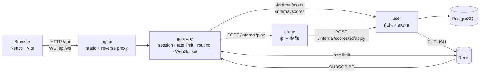

# Rock Paper Scissors — SE Challenge

เว็บเกมเป่ายิ้งฉุบที่ผู้เล่นแข่งกับบอท เก็บคะแนนต่อเนื่อง (Your Score) และสถิติสูงสุดของทั้งเว็บ (High Score) ซึ่งอัปเดตให้ทุกคนที่เปิดหน้าเว็บอยู่แบบ real-time

**Server installation:** ดู [DEPLOYMENT.md](./DEPLOYMENT.md) —  `cp .env.example .env` → set the 3 secrets → `docker compose up -d --build`

---

## Requirements coverage

| # | Requirement | การทำงาน |
|---|---|---|
| 1 | แสดงคะแนนสะสมปัจจุบัน (ไม่มี = 0) | โหลดจาก `GET /api/session` ตอนเปิดหน้า |
| 2 | แสดงคะแนนสูงสุด (ไม่มี = 0) | High Score ของทั้งเว็บ เก็บใน PostgreSQL |
| 3 | แพ้แล้ว reset Your Score เป็น 0 | ทำใน SQL `UPDATE` เดียวฝั่ง user service |
| 4 | action 3 แบบให้เลือก | ปุ่มสร้างจาก `MOVES` ใน shared package |
| 5 | บอทสุ่มแล้วแสดงค้าง 2 วิ ห้ามกดระหว่างนั้น | สุ่มที่ backend, UI ใช้สถานะ `idle → playing → revealing` ล็อกปุ่มทุกสถานะที่ไม่ใช่ `idle` |
| 6 | ครบ 2 วิ ชนะแล้วเพิ่มคะแนน และ reset bot action เป็น `???` | คะแนนคำนวณที่ server ทันที UI แสดงผลแล้วกลับเป็น `???` |
| 7 | Your Score > High Score ให้อัปเดต High Score | เก็บ `best_score` ต่อคน High Score = `MAX(best_score)` |

**ข้อกำหนดเพิ่มเติม**

- Frontend: React + TypeScript (Vite) ไม่ใช้ jQuery
- Backend: NestJS
- การสุ่มของบอทอยู่ที่ backend เท่านั้น (`crypto.randomInt`)
- High Score บันทึกที่ server และโหลดมาแสดงทุกครั้งที่เข้าเว็บ
- **(Bonus)** อัปเดต High Score ให้ทุก client แบบ real-time ผ่าน WebSocket
- จำ Your Score ด้วย signed cookie (ไม่ทำระบบ login ตามที่โจทย์อนุญาต)

**การตีความโจทย์**

- **เสมอ (DRAW)** — โจทย์ไม่ได้ระบุ เลือกให้คะแนนคงเดิม
- **High Score** — เป็นสถิติของทั้งเว็บ ไม่ใช่ของแต่ละคน เพื่อให้ข้อ real-time มีความหมาย

---

## Architecture



| Service | หน้าที่ | Port ภายใน |
|---|---|---|
| **web** (nginx) | Serves the frontend, ส่งต่อ `/api` และ `/api/ws` ไป gateway | 80 — **the only port exposed** |
| **gateway** | Issues/validates signed cookie, สร้าง guest, rate limit, routing, broadcast ผ่าน WebSocket | 3000 |
| **game** | สุ่ม action ของบอท, ตัดสินแพ้ชนะ | 3001 |
| **user** | เก็บข้อมูลผู้เล่นและคะแนน, rules, ประกาศเมื่อ High Score เปลี่ยน | 3002 |
| **postgres** | Source of truth for all data | 5432 |
| **redis** | pub/sub ของ High Score, cache, ตัวนับ rate limit | 6379 |
| **uptime-kuma** | monitor สถานะของ service (ดูหัวข้อ Monitoring) | เปิดที่ `127.0.0.1:3100` |

### In One round

1. Browser `POST /api/play { move }` → nginx → gateway
2. gateway อ่าน userId จาก signed cookie (ไม่มีหรือไม่ถูกต้อง → สร้าง guest ใหม่) แล้วเช็ก rate limit
3. gateway ส่งต่อไป game พร้อม `x-user-id` และ `x-internal-token`
4. game สุ่ม action ของบอท ตัดสินผล แล้วส่ง `{ playerMove, botMove, result }` ไป user
5. user อัปเดตคะแนนและบันทึกประวัติใน transaction เดียว คืน `currentScore`, `bestScore`, `highScore`
6. ถ้า High Score ขยับ user `PUBLISH` ลง Redis → gateway ทุกตัวที่ subscribe อยู่ broadcast ให้ทุก browser
7. response กลับถึง browser → UI แสดง action ของบอท 2 วินาที → กลับเป็น `???`

---

## Key decisions

**server ตัดสินและเขียนคะแนนทันทีใน request เดียว** — 2 วินาทีเป็นเรื่องของ UI ล้วน ๆ ไม่มี `setTimeout` ฝั่ง server ผลคือ refreshing หนีตอนรู้ว่าจะแพ้ไม่ได้ (คะแนน 0 ถูกบันทึกตั้งแต่กดปุ่ม) และไม่ต้องมีระบบ two-phase flow หรือ round id

**เจ้าของข้อมูลเป็นเจ้าของกติกา** — game รู้แค่แพ้ชนะ ส่วนกติกาคะแนน (ชนะ +1 / แพ้ = 0 / เสมอคงเดิม) อยู่ที่ user service ใน `UPDATE` เดียว:

- Postgres lock แถวระหว่างอัปเดต request ที่มาพร้อมกันจึงไม่ทำให้คะแนนเพี้ยน
- ใน `SET` ทุก expression อ้างค่าเดิมของ row ก่อนหน้านี้ จึงคำนวณ `best_score` จากคะแนนใหม่ได้ใน statement เดียว
- `CHECK (current_score >= 0)` เป็น defence สุดท้ายระดับ database

**ใช้ `pg` + SQL แทน ORM** — มี 3 ตาราง และ query ที่สำคัญที่สุดต้องเขียนเป็น SQL อยู่แล้ว Postgres รันไฟล์ `apps/user/db/*.sql` ตอนสร้าง volume ครั้งแรก การติดตั้งจึงไม่มีขั้น migrate แยก

**Redis pub/sub แทน Kafka/RabbitMQ** — มี event เดียวและไม่ต้องการ durability (High Score อ่านใหม่จาก DB ได้เสมอ) ใช้ Redis ที่ต้องมีอยู่แล้วสำหรับ rate limit การ Compare-write-publish ทำใน Lua script เดียว จึงประกาศเฉพาะตอนสถิติเปลี่ยนจริง และประกาศ**หลัง** commit เท่านั้น

**WebSocket อยู่ที่ gateway และรับ event ผ่าน Redis** — ถ้ามี gateway หลายตัวหลัง load balancer ทุกตัว subscribe ช่องเดียวกัน ผู้เล่นได้ event ครบไม่ว่าจะต่ออยู่กับตัวไหน ใช้ `ws` แทน socket.io เพราะ browser ใช้ `WebSocket` ในตัวได้เลย

**Dependency Inversion ที่ game** — `GameService` พึ่ง abstract class `ScoreClient` ไม่ใช่ HTTP client โดยตรง เปลี่ยนวิธี transport แก้ที่ module บรรทัดเดียว และ unit test ใช้ fake ได้โดยไม่ต้องเปิด service จริง

**Graceful degradation** — service ข้างหลังล่มหรือช้าเกิน timeout gateway ตอบ 503 หน้าเว็บแจ้งผู้ใช้และกดเล่นใหม่ได้; Redis ล่ม เกมยังเล่นได้ (ไม่มี real-time และ rate limit ปล่อยผ่าน); WebSocket หลุด หน้าเว็บต่อใหม่เองทุก 2 วินาที

---

## Anti-cheat

| Attack | Mitigation |
|---|---|
| ส่งคะแนนหรือผลลัพธ์มาเอง | ไม่มี endpoint ใดรับคะแนนจาก client และ `ValidationPipe({ whitelist: true })` ตัด field แปลกปลอมทิ้ง |
| เลือก action ของบอท | สุ่มที่ backend ด้วย `crypto.randomInt` |
| รีเฟรชหนีก่อนแพ้ | คะแนนถูกบันทึกทันทีที่กด ไม่ได้รอครบ 2 วิ |
| แก้ cookie เพื่อสวมรอย | signed cookie — ลายเซ็นไม่ตรงถือเป็นผู้เล่นใหม่ |
| ยิงคำขอรัว | เล่นได้ 1 ครั้งต่อ `PLAY_MIN_INTERVAL_MS` ต่อผู้เล่น (ตั้งต่ำกว่าเวลาล็อกของ UI เผื่อเน็ตแกว่ง) |
| สร้าง guest ท่วมฐานข้อมูล | จำกัดต่อ IP ต่อช่วงเวลา (อ่าน IP จริงจาก `X-Forwarded-For` ที่ nginx ส่งมา) |
| ยิงตรงเข้า game/user | ไม่เปิด port ออกนอก Docker network และทุก request ต้องมี `x-internal-token` |
| กดสองครั้งพร้อมกัน | UI ล็อกทันทีที่กด (ไม่รอ response) + rate limit ฝั่ง server + SQL lock แถว |

ทุกข้อในตารางนี้ถูกตรวจอัตโนมัติด้วย `scripts/smoke-test.sh`

---

## Project layout

```
rps-assignment/
├─ apps/
│  ├─ web/            React + Vite + SCSS
│  ├─ gateway/        NestJS — session, rate limit, routing, WebSocket
│  ├─ game/           NestJS — สุ่ม + ตัดสิน
│  └─ user/           NestJS — ผู้เล่น + คะแนน
│     └─ db/          SQL สร้างตาราง (Postgres รันตอน init)
├─ packages/
│  └─ shared/         type, ค่าคงที่ และ contract ที่ทุกฝั่งใช้ร่วมกัน
├─ e2e/               Playwright
├─ docker/
│  ├─ node-service.Dockerfile   ใช้ร่วมกัน gateway / game / user
│  ├─ web.Dockerfile
│  └─ nginx.conf
├─ scripts/smoke-test.sh
├─ docker-compose.yml           ระบบเต็ม (production)
├─ docker-compose.dev.yml       เฉพาะ postgres + redis สำหรับพัฒนา
├─ docker-compose.e2e.yml       override สำหรับรัน E2E
└─ .env.example
```

`packages/shared` ทำให้ frontend และทุก service อ้าง `Move`, `PlayResponse`, `HIGH_SCORE_CHANNEL`, `ERROR_CODES` จากที่เดียว — แก้แล้วฝั่งไหนไม่ตรงจะ compile ไม่ผ่าน

---

## Tech stack

| ส่วน | เทคโนโลยี |
|---|---|
| Frontend | React, TypeScript, Vite, SCSS |
| Backend | NestJS 12, TypeScript (ESM) |
| Database | PostgreSQL 16 (`pg`, SQL ล้วน) |
| Cache / Pub-Sub / Rate limit | Redis 7 (`ioredis`) |
| Real-time | WebSocket (`ws`, `@nestjs/platform-ws`) |
| Reverse proxy | nginx |
| Container | Docker, Docker Compose v2 |
| Monorepo | pnpm workspace |
| Test | Vitest, Playwright |
| Monitoring | Uptime Kuma |

---

## Getting started

### Run with Docker

```bash
cp .env.example .env     # ตั้ง POSTGRES_PASSWORD, INTERNAL_TOKEN, COOKIE_SECRET
docker compose up -d --build
```

เปิด `http://<server>` (port ตาม `WEB_PORT` ค่าเริ่มต้น 80) — ขั้นตอนละเอียดและการแก้ปัญหาอยู่ใน [DEPLOYMENT.md](./DEPLOYMENT.md)

### Local development

ต้องมี Node.js 24, pnpm 12, Docker

```bash
pnpm install
cp .env.example .env
pnpm infra          # postgres (5433) + redis (6379)
pnpm build:shared
pnpm dev            # shared (watch), web :5173, gateway :3000, game :3001, user :3002
```

เปิด `http://localhost:5173` — Vite ส่งต่อ `/api` และ WebSocket ไป gateway

| Command | Purpose |
|---|---|
| `pnpm dev` | รันทุก app แบบ watch |
| `pnpm infra` / `pnpm infra:down` | เปิด/ปิด postgres + redis สำหรับ dev |
| `pnpm build:shared` | build `@rps/shared` (ต้องรันหลังแก้ shared) |
| `pnpm stack` / `pnpm stack:down` | เปิด/ปิดระบบเต็มด้วย Docker |
| `pnpm test` | unit test ทุก app |
| `pnpm smoke` | smoke test กับระบบที่รันอยู่ |

> แก้อะไรใน `packages/shared` ต้อง `pnpm build:shared` แล้วรีสตาร์ท service ที่ใช้ เพราะ service อ่านจาก `dist` ของ shared

---

## Configuration

ใช้ `.env` ไฟล์เดียวที่ root ทั้งตอน dev และตอนรัน Docker แบ่งเป็นสามกลุ่มตามไฟล์ `.env.example`

**ต้องตั้งก่อน deploy** (สร้างด้วย `openssl rand -hex 32`)

| Variable | Purpose |
|---|---|
| `POSTGRES_PASSWORD` | รหัสผ่านฐานข้อมูล — ใช้ตัวอักษรและตัวเลขเท่านั้น |
| `INTERNAL_TOKEN` | token ที่ service ใช้คุยกันภายใน |
| `COOKIE_SECRET` | กุญแจเซ็น session cookie |

**ปรับได้**

| Variable | Default | Purpose |
|---|---|---|
| `WEB_PORT` | `80` | port ที่เปิดให้ผู้ใช้เข้า |
| `MONITOR_PORT` | `3100` | หน้า Uptime Kuma (ผูกกับ `127.0.0.1` เท่านั้น) |
| `VITE_REVEAL_DURATION_MS` | `2000` | เวลาแสดง action ของบอท — ฝังตอน build ต้อง build web ใหม่เมื่อเปลี่ยน |
| `PLAY_MIN_INTERVAL_MS` | `1500` | ระยะห่างขั้นต่ำระหว่างการเล่น **ต้องน้อยกว่า** `VITE_REVEAL_DURATION_MS` |
| `GUEST_CREATE_LIMIT` / `GUEST_CREATE_WINDOW_MS` | `20` / `60000` | โควตาสร้างผู้เล่นใหม่ต่อ IP |
| `COOKIE_SECURE` | `false` | ตั้ง `true` เมื่อใช้ HTTPS |
| `SESSION_COOKIE_NAME` | `rps_sid` | ชื่อ cookie |
| `UPSTREAM_TIMEOUT_MS` / `USER_SERVICE_TIMEOUT_MS` | `3000` | timeout ของการเรียก service ข้างหลัง |
| `POSTGRES_USER` / `POSTGRES_DB` | `rps` | ชื่อผู้ใช้และฐานข้อมูล |

กลุ่มสุดท้ายของ `.env.example` (`*_PORT`, `*_SERVICE_URL`, `DATABASE_URL`, `REDIS_URL`, `CORS_ORIGIN`, `TRUST_PROXY`) ใช้เฉพาะตอน `pnpm dev` — ใน Docker compose กำหนดค่าเหล่านี้เป็นชื่อ service ภายใน network ให้เอง

---

## API

**Public** (ผ่าน nginx → gateway)

| Method | Path | Description |
|---|---|---|
| `GET` | `/api/session` | `{ currentScore, highScore }` ของผู้เล่นปัจจุบัน (สร้าง guest ถ้ายังไม่มี) |
| `POST` | `/api/play` | body `{ move }` → `{ playerMove, botMove, result, currentScore, highScore }` |
| `WS` | `/api/ws` | รับ `{ type: "high_score", highScore }` เมื่อ High Score เปลี่ยน |

**Internal** (ต้องมี `x-internal-token` และเข้าถึงได้เฉพาะใน Docker network)

| Service | Method | Path |
|---|---|---|
| game | `POST` | `/internal/play` (header `x-user-id`) |
| user | `POST` | `/internal/users/guest` |
| user | `GET` | `/internal/scores/:userId` |
| user | `POST` | `/internal/scores/:userId/apply` |
| ทุกตัว | `GET` | `/health` — ไม่ต้องใช้ token และไม่เปิดออกนอก |

---

## Database

| Table | Contents |
|---|---|
| `users` | ผู้เล่น (`is_guest`; `username`, `password_hash` เว้นไว้สำหรับระบบสมัครสมาชิกในอนาคต) |
| `player_scores` | `current_score`, `best_score` ต่อผู้เล่น (1:1 กับ `users`) มี index `best_score DESC` |
| `rounds` | ประวัติทุกตา — audit trail สำหรับตรวจสอบการโกง |

guest ถูกสร้างพร้อมแถวคะแนนใน statement เดียว (CTE) ผู้เล่นทุกคนจึงมีแถวคะแนนเสมอ

---

## Testing

### Unit test

```bash
pnpm test                       # ทุก app
pnpm --filter gateway test:cov  # พร้อม coverage
```

| Suite | Coverage |
|---|---|
| `game/rules` | ทั้ง 9 คู่ของการตัดสิน และการสุ่มที่ต้องอยู่ใน `MOVES` เสมอ |
| `game/GameService` | ตัดสินแล้วส่งให้ score client บันทึก (ใช้ fake `ScoreClient`) |
| `gateway/SessionService` | cookie ถูก / ถูกแก้ / ไม่ใช่ uuid / user หายแล้ว retry ครั้งเดียว / โดนโควตา |
| `gateway/UpstreamClient` | ส่งต่อ 400, แปลง 401/404/500 เป็น 503, แยก `USER_NOT_FOUND` |
| `user/ScoresService` | บันทึกใน transaction เดียว, ประกาศ **หลัง** commit, rollback เมื่อไม่มี user |
| `web/useGame` | โหลดคะแนน, ล็อกปุ่มทันทีที่กด, ปลดเมื่อครบ 2 วิ, กดซ้ำไม่ส่ง request, High Score ไม่ถอยหลัง |

เทส `useGame` จับ bug จริงได้หนึ่งตัว: การกดซ้ำถูกกันด้วยการ disable ปุ่มเท่านั้น แต่ตัว hook ยังส่ง request ซ้ำได้ — แก้ด้วยการเช็กสถานะผ่าน `useRef` แบบ synchronous

### Smoke test

```bash
pnpm smoke                      # หรือ ./scripts/smoke-test.sh
```

ตรวจ 23 ข้อกับระบบที่รันอยู่จริงผ่าน nginx: กติกาคะแนน, ความถูกต้องของการตัดสิน, rate limit, input ที่ผิด, การส่งคะแนนปลอม, cookie ที่ถูกแก้, WebSocket upgrade, port หลังบ้านที่ต้องปิด และ `/health` ของทุก service — ใช้แค่ `bash` กับ `curl`

### E2E (Playwright)

```bash
pnpm --filter e2e stack:up      # ขึ้นระบบชุดแยกที่ port 8081
pnpm --filter e2e test
pnpm --filter e2e stack:down
```

สามเคสบน Chromium และ WebKit (engine เดียวกับ Safari): ปุ่มถูกล็อกระหว่างแสดงผลแล้วปลดเองเมื่อครบเวลา, คะแนนเปลี่ยนตามกติกาทุกตา, High Score เด้งหาผู้เล่นอื่นแบบ real-time

> เคส real-time ต้องเล่นจนชนะติดกันเกินสถิติเดิม ซึ่งผลของเกมเป็นการสุ่มจริงจาก backend เทสนี้จึงไม่ผ่านในบางรอบเมื่อจำนวนตาที่เล่นไม่พอ ไม่ใช่ความผิดพลาดของระบบ

---

## Monitoring

Uptime Kuma ping `/health` ของ gateway, game และ user — `/health` ของแต่ละตัวตรวจ dependency ของตัวเองจริง (user ตรวจ Postgres + Redis, gateway ตรวจ Redis, game ไม่มี dependency) จึงบอกได้ว่าอะไรพังโดยไม่ลากกันล่ม เมื่อหยุด Redis จะเห็น gateway กับ user เป็นสีแดง ส่วน game ยังเขียว

หน้า Kuma ผูกไว้กับ `127.0.0.1` เพราะผู้ที่เปิดหน้าเป็นคนแรกจะได้สร้างบัญชี admin — เข้าจากเครื่องอื่นผ่าน SSH tunnel เท่านั้น (ดู DEPLOYMENT.md)

`/health` เดียวกันนี้ถูกใช้เป็น healthcheck ของ container ด้วย gateway จึงเริ่มหลัง game/user พร้อมจริง และ nginx เริ่มหลัง gateway พร้อมจริง

---

## Known limitations

- High Score บนจอไม่ลดลงจนกว่าจะรีเฟรช (กัน event มาไม่ตรงลำดับ) หากล้างฐานข้อมูล หน้าที่เปิดค้างจะแสดงค่าเก่า
- ไม่ได้ส่ง snapshot ตอน WebSocket ต่อสำเร็จ จึงมีช่วงสั้น ๆ ระหว่างโหลดหน้ากับต่อ socket ที่อาจพลาด event
- ไม่มี migration runner — เปลี่ยน schema ต้องเขียน SQL เอง (ต่อยอดด้วย node-pg-migrate)
- `InternalTokenGuard` ซ้ำใน game และ user — แยกเป็น package กลางเมื่อมี service เพิ่ม
- ใช้ internal token ตัวเดียวกันทุก service (production จริงควรใช้ mTLS หรือ token แยกต่อ service)
- `RateLimiter` ไม่มี unit test — ครอบคลุมด้วย smoke test แทน
- ไม่มี HTTPS ในตัว ควรวาง TLS termination ไว้ข้างหน้าแล้วตั้ง `COOKIE_SECURE=true`
- ตาราง `rounds` ยังไม่มี retention policy

---

## Bonus checklist

- [x] TypeScript (ทั้ง frontend และ backend)
- [x] SCSS
- [x] Docker (multi-stage, non-root, Dockerfile เดียวใช้ได้ 3 service)
- [x] Message broker — Redis pub/sub (เหตุผลที่ไม่ใช้ Kafka/RabbitMQ อยู่ในหัวข้อ "Key decision")
- [x] API Gateway
- [x] Load balancer / reverse proxy — nginx
- [x] Service monitor tool — Uptime Kuma
- [x] API testing script — `scripts/smoke-test.sh`
- [x] End-to-End Test — Playwright (Chromium + WebKit)
